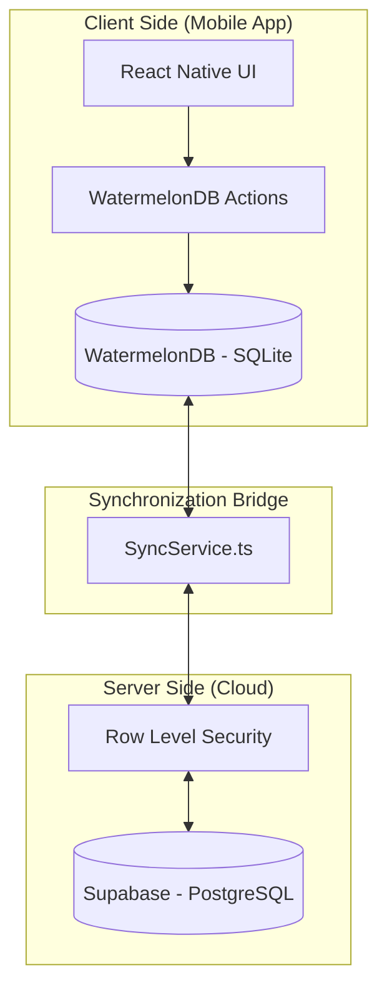
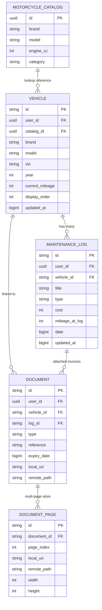

# Database Architecture - Bike Service

This document provides a comprehensive technical overview of the database design, synchronization logic, and architectural decisions made for the Bike Service application.

## 1. High-Level Architecture

The application follows an **Offline-First** architecture. This means the user's phone is the primary database, and the cloud (Supabase) serves as a persistent backup and synchronization hub.

---

## 2. Entity Relationship Diagram (ERD)

The following diagram shows the logical relationships between entities. All user-specific data is isolated using a `user_id` linked to Supabase Auth.

---

## 3. Detailed Table Definitions

### 3.1 `vehicles`
Stores user-owned motorcycles.
- **`display_order`**: Used in the UI to allow users to reorder their garage cards.
- **`catalog_id`**: An optional reference to the global `motorcycle_catalog` for richer data (brand, category).

### 3.2 `maintenance_logs`
Stores service records, repairs, and modifications.
- **`cost`**: Stored as an integer (whole currency units, e.g., cents or euros depending on locale) to avoid floating-point errors (Standard Practice).
- **`mileage_at_log`**: Used to update the vehicle's `current_mileage` via a trigger or service logic.

### 3.3 `documents` & `document_pages`
Stores attachments (Invoices, Insurance, Registration).
- **Split Structure**: `documents` holds metadata, while `document_pages` allows a single document (like a multi-page PDF or 3 photos of a long invoice) to be stored as individual images.
- **Storage Strategy**: `local_uri` is a path on the phone's filesystem. `remote_path` is the path in Supabase Storage.

### 3.4 `motorcycle_catalog`
A **read-only** reference table containing ~1,300+ known bike models. Unlike other tables, this is *global* and not scoped per user.

---

## 4. Architectural Decisions (The "Why")

### 4.1 Why Text-based IDs (UUIDs/Strings)?
Instead of auto-incrementing integers (1, 2, 3), we use strings (UUIDs).
- **Offline Creation**: If a user is in a basement garage with no signal, they need to create a record. Their phone generates a unique string instantly.
- **Collision Prevention**: If we used numbers, two users might both create "Bike #5" while offline. When they sync, the server would crash or overwrite data. UUIDs guarantee global uniqueness.

### 4.2 Why BigInt Timestamps?
We store `updated_at` and `created_at` as milliseconds since epoch (`1710691200000`) rather than ISO strings or Postgres TIMESTAMPTZ.
- **WatermelonDB Sync**: The sync engine compares numbers to determine which record is newer.
- **Performance**: Integer comparisons are significantly faster than string or date parsing at scale.

### 4.3 Soft Deletes (`deleted_at`)
Records are never immediately `DELETE`ed from the database during sync. Instead, we set a `deleted_at` timestamp.
- **Sync Reliability**: If a record is hard-deleted on the phone, the server won't know it's gone during the next sync. By using a "tombstone" (soft delete), the server can see the delete flag and mirror it.

---

## 5. Security & Isolation

We implement **Multi-Tenancy** via **Supabase Row Level Security (RLS)**.

1. **User Isolation**: All tables (except the Catalog) have a `user_id` column.
2. **Policy Logic**: Every query to Supabase is automatically filtered by the policy:
   `auth.uid() = user_id`
3. **Data Protection**: Even if someone knows the ID of your vehicle, they cannot read it because they are not authenticated as you.

---

## 6. How to Reset / Maintenance

- **Local Reset**: The app runs `database.unsafeResetDatabase()` on logout to prevent data leaking between users sharing a device.
- **Schema Updates**: 
  - Mobile changes: Handled via `mobile/src/database/migrations.ts`.
  - Supabase changes: Handled via SQL scripts in the project root (`supabase_migration_v7.sql`).
